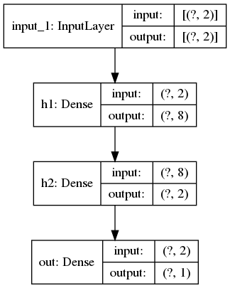

# XOR Simulation

This simulation shows how the hidden layer transform the non-linear problem into a linear one so that the output layer is able to solve it.

## Setup

```bash
conda create -n deep-learning -y python=3.7
conda activate deep-learning
conda install --file requirements.txt
```

## Dataset


## Network Structure



## Hidden Layer Output

